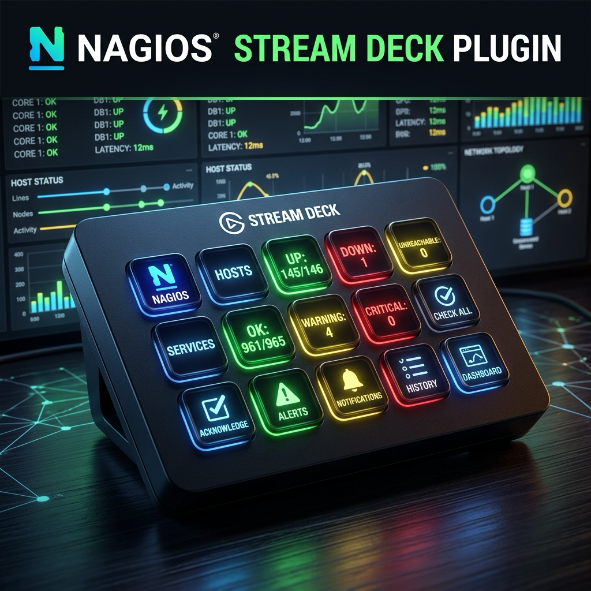
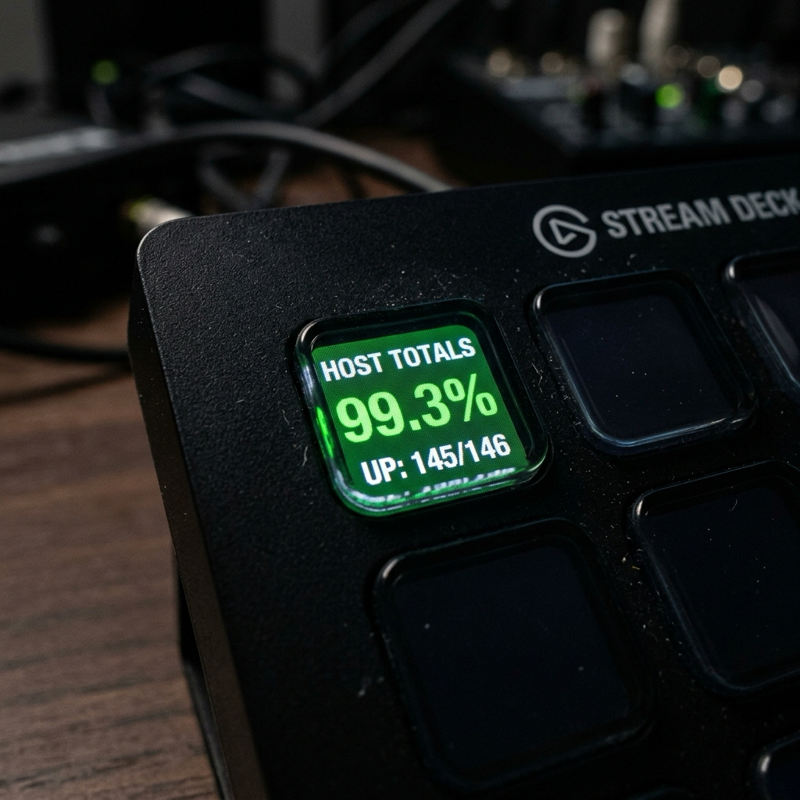
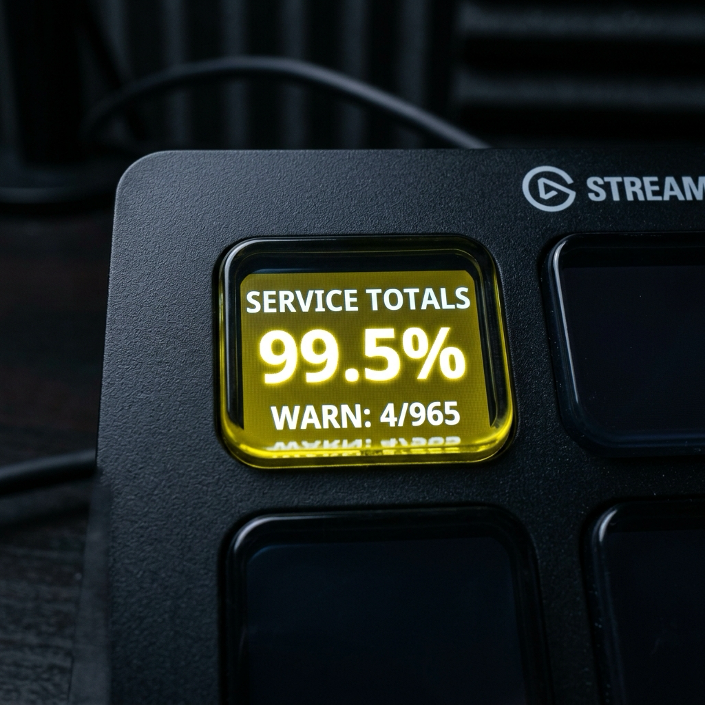
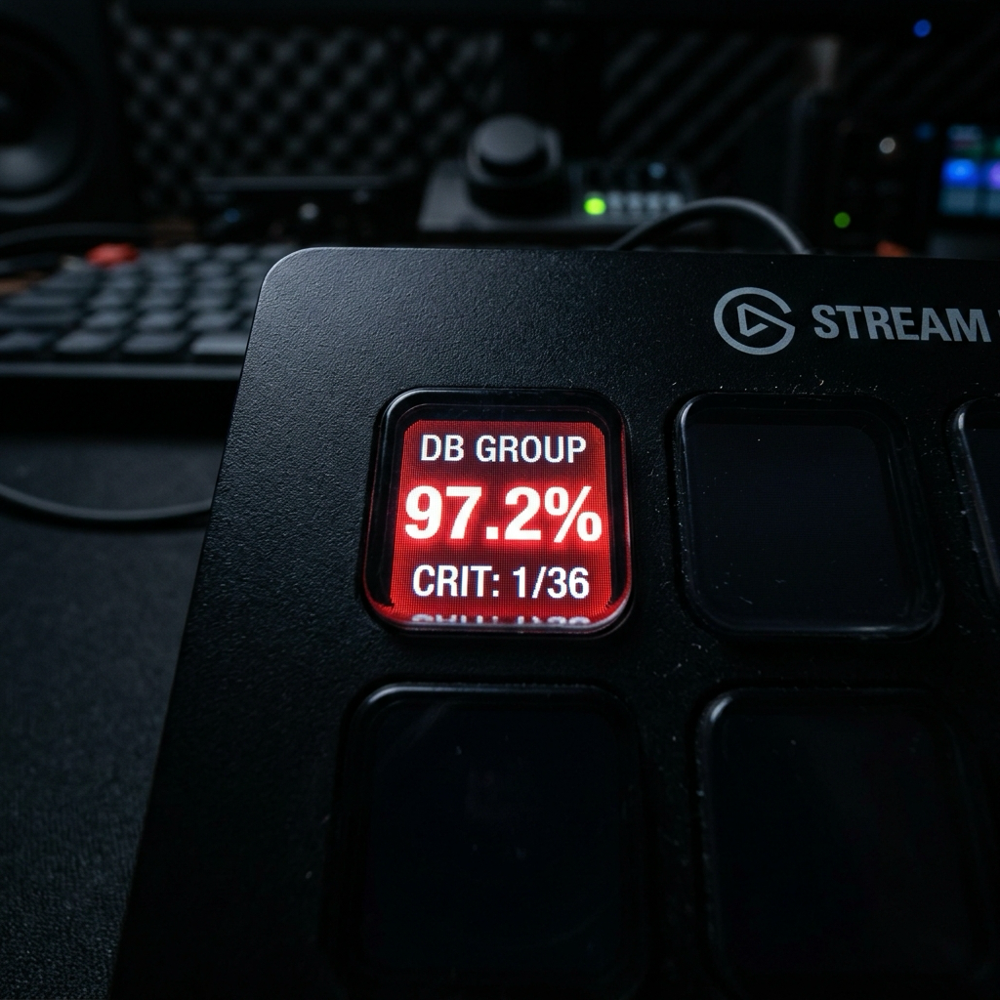

# Status Monitor for Nagios — Stream Deck Plugin



Bring Nagios Core monitoring straight to your fingertips. This Stream Deck plugin displays real-time host and service statuses, calculated overall availability, and group-level telemetry directly on your keys.

---

## 🔗 Quick Links
*   **[Release Notes](releasenotes.md)**: Track versions, new features, and changes.
*   **[Developer Walkthrough](walkthrough.md)**: Detailed code architecture, requirements, and build setup.
*   **[Marketplace Description](marketplace_description.md)**: Ready-to-copy metadata for submitting to Elgato's Maker Console.

---

## ✨ Features
*   🟢 **Real-Time Key Indicators**: Buttons update color dynamically (Green for OK/UP, Yellow for Warning, Red for Critical/DOWN, Grey for Unknown/Unreachable/Offline).
*   📈 **Background Status Graphs**: Render a beautiful sparkline graph directly in the background of your button keys to track availability percentages and status trends over time.
*   📊 **Tactical Totals**: Display overall network availability percentages and success ratios (e.g. `UP: 145/146` or `OK: 961/965`) directly on a single key.
*   🏷️ **Group-Scoped Monitoring**: Limit totals checks to a specific **Hostgroup** or **Servicegroup** via simple dropdown menus.
*   ⚙️ **Custom Alert Thresholds**: Configure custom Warning and Critical percentages for totals buttons to trigger yellow/red warnings.
*   ⚡ **Click Actions**: Press any key to open the corresponding Nagios configuration page, extended status info (`extinfo.cgi`), or group status page in your default browser.
*   🚀 **High-Performance Scaling**: Uses optimized `tac.cgi` parsing for global totals to avoid server-side timeouts (HTTP 500) on large Nagios installations.
*   📝 **Smart Line Splitting**: Long host/service names containing spaces, dashes, or underscores are automatically split across two lines for clean reading.

---

## 📸 Screenshots

| Host Totals (Green) | Service Totals (Warning) | Group Totals (Critical) |
| :---: | :---: | :---: |
|  |  |  |

---

## 🚀 Getting Started

### 1. Installation
1. Download the latest **`com.joern-arne.nagios.streamDeckPlugin`** file from the [Releases](../../releases/latest) page.
2. Double-click the file to install the plugin directly into your Elgato Stream Deck software.

### 2. Connection Setup
1. Drag the **Status Monitor** action from the actions sidebar onto an empty slot on your Stream Deck.
2. In the Property Inspector panel below the keys:
    *   Enter your **Nagios Base URL** (e.g., `https://nagios.example.com/nagios`).
    *   Provide your basic authentication **Username** and **Password**.
    *   Click **Connect**.

### 3. Button Configuration
*   **Host**: Select a specific host from the dropdown to monitor its UP/DOWN status.
*   **Service**: Select a host, then select one of its monitored services to display its OK/WARNING/CRITICAL status.
*   **Host Totals**: Calculates overall host availability. You can configure:
    *   *Hostgroup*: Scope the counts to a specific group (or leave empty for all hosts).
    *   *Thresholds*: Define custom warning (default: `99.0%`) and critical (default: `98.0%`) limits.
*   **Service Totals**: Calculates overall service availability. You can configure:
    *   *Servicegroup* or *Hostgroup* filters.
    *   *Thresholds*: Define custom warning (default: `99.0%`) and critical (default: `98.0%`) limits.
*   **Background Graphs**: Available for all monitored types. Check "Show Graph" and choose a "Graph Duration" (from 5 minutes up to 24 hours, default 60 min) in the Property Inspector to display a real-time status trend sparkline behind the status text. Polling keeps running in the background even when buttons are off-screen to log uninterrupted history data points.

---

## 🛠️ Development

If you want to modify, compile, or debug the plugin locally:

### Prerequisites
*   Node.js (v20+ recommended)
*   Stream Deck CLI installed locally:
    ```bash
    npm install
    ```

### Compilation
Build the TypeScript source files into the bundle:
```bash
make build   # Or: npm run build
```

### Local Linking & Debugging
To symlink your development folder to the Stream Deck app so changes apply live:
```bash
make link    # Or: npx @elgato/cli link com.joern-arne.nagios.sdPlugin
```
Start the watch script to build and automatically reload the plugin when files change:
```bash
make watch   # Or: npm run watch
```

### Packaging
To package a new `.streamDeckPlugin` distribution installer:
```bash
make pack    # Or: npx @elgato/cli pack com.joern-arne.nagios.sdPlugin --force
```

---

## 🔍 Troubleshooting & Prerequisites
If your buttons show **Offline** or **HTTP 500**:
1. **API Access**: Ensure that your Nagios user has permission to read the CGIs. The plugin utilizes `statusjson.cgi` (for single hosts/services and group queries) and `objectjson.cgi` (to fetch group lists).
2. **Tactical Overview**: If `statusjson.cgi` is disabled or too slow, the plugin falls back to reading `tac.cgi`. Ensure your user has permissions to view the Tactical Overview.
3. **HTTPS / Certificates**: If your Nagios instance uses self-signed SSL certificates, the plugin execution environment might block requests. Ensure your certificate is trusted by your system.

---

## ⚖️ License & Trademark Disclaimer

This project is licensed under the **MIT License**.

*Disclaimer: Nagios and Nagios Core are registered trademarks of Nagios Enterprises, LLC. This plugin is an independent, community-driven open-source project and is not officially affiliated with, sponsored by, or endorsed by Nagios Enterprises, LLC.*
